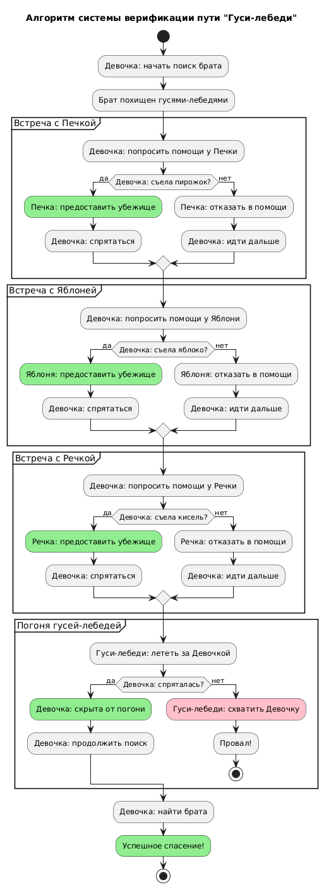
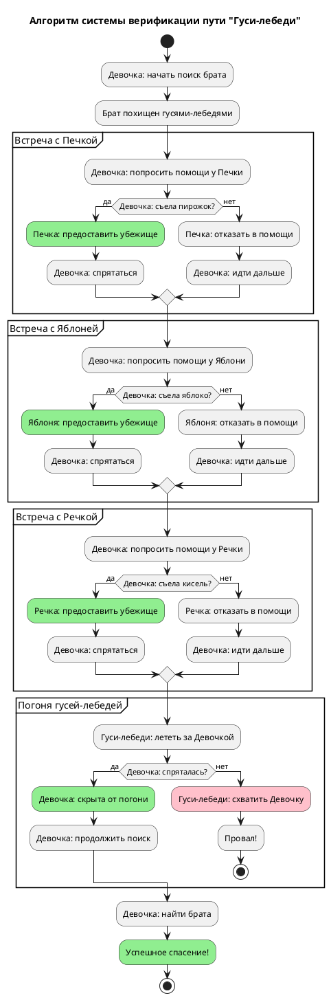

# Activity Diagram: Алгоритм системы верификации пути "Гуси-лебеди"

## Обзор

Эта диаграмма активности показывает алгоритм работы системы поиска брата и спасения от гусей-лебедей.

## Описание потока

### Шаг 1: Начало поиска
- Девочка начинает поиск брата
- Брат похищен гусями-лебедями

### Шаг 2: Первая встреча с Печкой
- Девочка просит помощи у Печки
- Проверка: Девочка съела пирожок?
- **Нет** → Печка не помогает, Девочка идёт дальше
- **Да** → Девочка получает убежище от Печки

### Шаг 3: Встреча с Яблоней
- Девочка просит помощи у Яблони
- Проверка: Девочка съела яблоко?
- **Нет** → Яблоня не помогает, Девочка идёт дальше
- **Да** → Девочка получает убежище от Яблони

### Шаг 4: Встреча с Речкой
- Девочка просит помощи у Речки
- Проверка: Девочка съела кисель?
- **Нет** → Речка не помогает, Девочка идёт дальше
- **Да** → Девочка получает убежище от Речки

### Шаг 5: Погоня гусей-лебедей
- Гуси-лебеди летят за Девочкой
- Проверка: Девочка спряталась?
- **Да** → Девочка скрыта от погони, возвращается к поиску
- **Нет** → Гуси-лебеди хватают Девочку

### Шаг 6: Спасение брата
- Девочка находит брата
- Успешное завершение

## Точки принятия решений

| Условие | Результат |
|-----------|--------|
| Печка: съела пирожок? | Нет → не помогает / Да → убежище |
| Яблоня: съела яблоко? | Нет → не помогает / Да → убежище |
| Речка: съела кисель? | Нет → не помогает / Да → убежище |
| Девочка спряталась? | Да → скрыта / Нет → схвачена |

## Диаграмма

