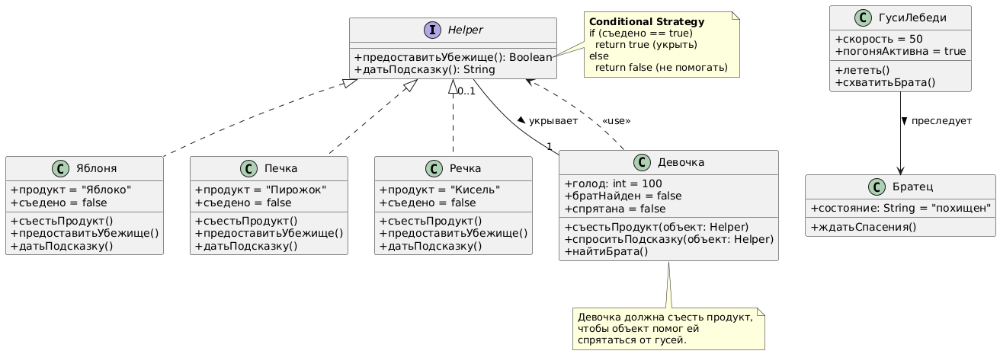
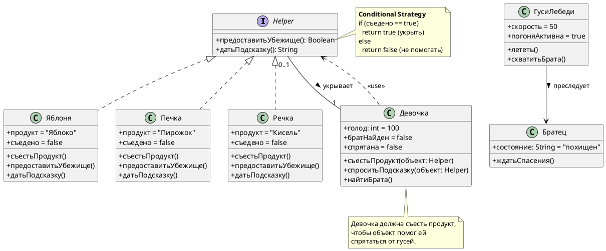

# Class Diagram: Гуси-лебеди

## Обзор

Эта диаграмма классов показывает объектно-ориентированную структуру системы сказки "Гуси-лебеди".

## Иерархия классов

### Иерархия помощников (Helper)

| Class | Type | Attributes | Methods |
|-------|------|------------|---------|
| Helper | Interface | - | + предоставитьУбежище(): Boolean<br>+ датьПодсказку(): String |
| Яблоня | Concrete | + продукт = "Яблоко"<br>+ съедено = false | + съестьПродукт()<br>+ предоставитьУбежище()<br>+ датьПодсказку() |
| Печка | Concrete | + продукт = "Пирожок"<br>+ съедено = false | + съестьПродукт()<br>+ предоставитьУбежище()<br>+ датьПодсказку() |
| Речка | Concrete | + продукт = "Кисель"<br>+ съедено = false | + съестьПродукт()<br>+ предоставитьУбежище()<br>+ датьПодсказку() |

### Иерархия персонажей

| Class | Type | Attributes | Methods |
|-------|------|------------|---------|
| Девочка | Concrete | + голод: int = 100<br>+ братНайден = false<br>+ спрятана = false | + съестьПродукт(объект: Helper)<br>+ спроситьПодсказку(объект: Helper)<br>+ найтиБрата() |
| ГусиЛебеди | Concrete | + скорость = 50<br>+ погоняАктивна = true | + лететь()<br>+ схватитьБрата() |
| Братец | Concrete | + состояние: String = "похищен" | + ждатьСпасения() |

### Контроллер

| Класс | Тип | Методы |
|-------|------|---------|
| Девочка | Конкретный | + попроситьПомощи(объект: Helper) |

## Связи

- **Девочка ..> Helper**: Использует (<<use>>)
- **ГусиЛебеди --> Братец**: Преследует (<<chase>>)
- **Helper "0..1" -- "1" Девочка**: Укрывает (<<hide>>)

## Шаблоны проектирования

### Стратегия верификации (Conditional Help)
```java
public boolean предоставитьУбежище() {
    if (съедено) {
        return true;  // Скрывает девочку
    } else {
        return false; // Не помогает
    }
}
```

## Заметки

- **Девочка** должна выполнить просьбу объекта (съесть продукт), чтобы получить помощь
- **Яблоня**, **Печка**, **Речка** реализуют интерфейс Helper
- **Гуси-лебеди** — антагонисты, преследуют девочку и братца
- Условие "съел продукт" — ключевая проверка перед предоставлением убежища

## Диаграмма




