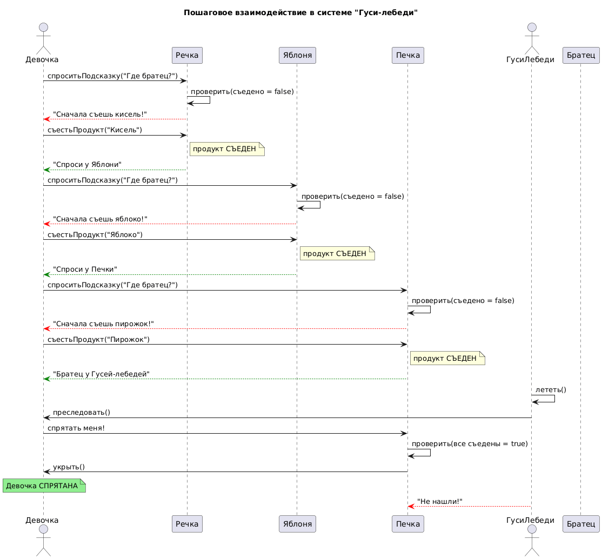
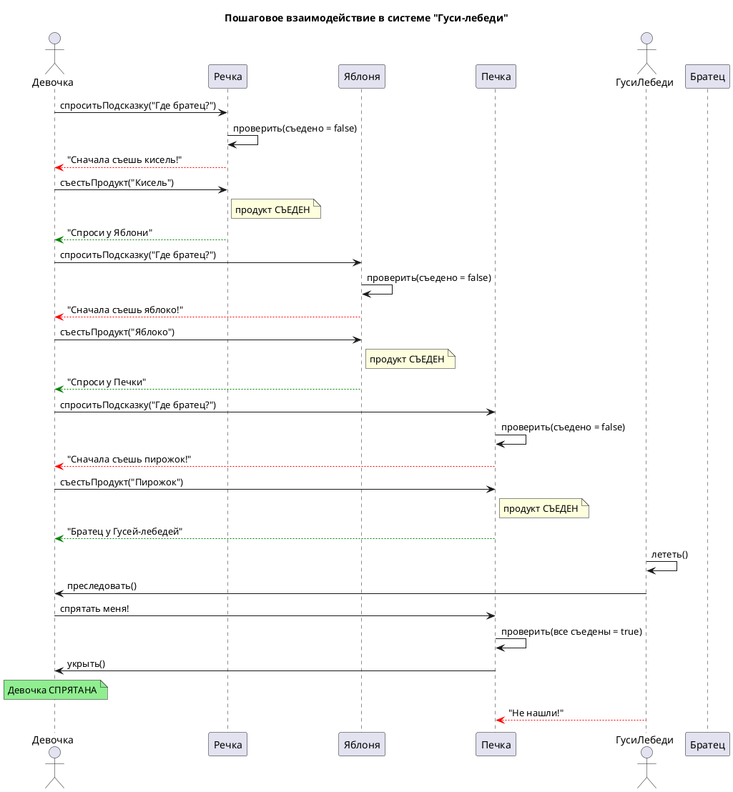

# Sequence Diagram: Взаимодействие в системе "Гуси-лебеди"

## Обзор

Эта диаграмма последовательности показывает пошаговое взаимодействие между актерами и объектами в системе "Гуси-лебеди".

## Актеры и участники

| Актер/Участник | Описание |
|-------------------|-------------|
| Девочка (G) | Girl looking for brother |
| Речка (R) | River with kissel (кисель) |
| Яблоня (AT) | Apple tree with apples |
| Печка (S) | Stove with pies |
| ГусиЛебеди (GS) | Geese chasing the girl |
| Братец (B) | Kidnapped brother |

## Interaction Steps

### Шаг 1: Поиск брата у Речки
- Девочка asks Речка for help
- Речка checks: продукт съеден? (false)
- Речка responds: "Съешь кисель!"

### Шаг 2: Выполнение просьбы (Речка)
- Девочка eats the product from Речка
- Note: продукт СЪЕДЕН (продукт eaten)
- Речка gives hint: "Спроси у Яблони"

### Шаг 3: Поиск у Яблони
- Девочка asks Яблоня for help
- Яблоня checks: продукт съеден? (false)
- Яблоня responds: "Съешь яблоко!"

### Шаг 4: Выполнение просьбы (Яблоня)
- Девочка eats the product from Яблоня
- Note: продукт СЪЕДЕН (продукт eaten)
- Яблоня gives hint: "Спроси у Печки"

### Шаг 5: Поиск у Печки
- Девочка asks Печка for help
- Печка checks: продукт съеден? (false)
- Печка responds: "Съешь пирожок!"

### Шаг 6: Выполнение просьбы (Печка)
- Девочка eats the product from Печка
- Note: продукт СЪЕДЕН (продукт eaten)
- Печка gives hint: "Братец у Гусей-лебедей"

### Шаг 7: Погоня и укрытие
- ГусиЛебеди start flying and chasing
- Девочка asks Печка to hide her
- Печка checks: все продукты съедены? (true)
- Печка hides the girl
- Note over G: Девочка СПРЯТАНА (Girl is HIDDEN)

## Ключевые наблюдения

1. Речка, Яблоня и Печка не помогают, пока девочка не съест их продукт
2. Каждый объект даёт подсказку о следующем объекте
3. После выполнения всех просьб объект может укрыть девочку от гусей
4. Гуси-лебеди начинают погоню после того, как девочка узнаёт, где братец

## Диаграмма

