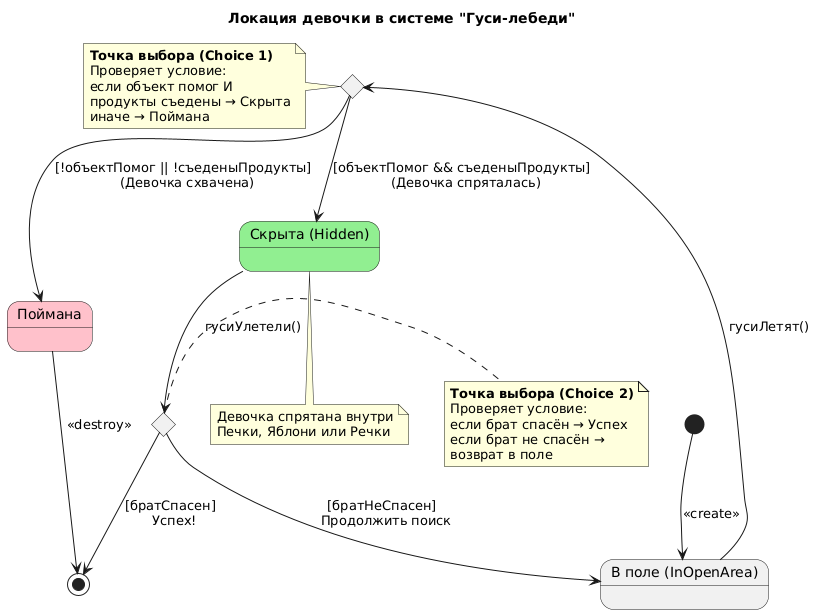
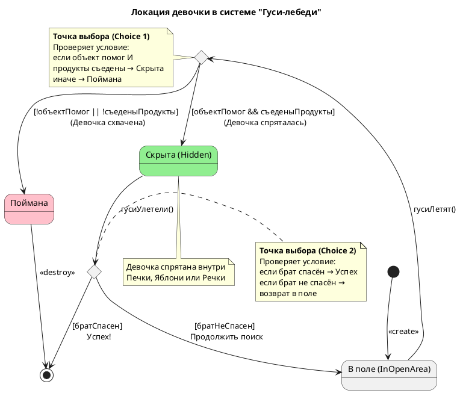

# State Diagram: Локация девочки в системе "Гуси-лебеди"

## Обзор

Эта диаграмма состояний показывает жизненный цикл локации девочки во время погони гусей-лебедей.

## Состояния

| Состояние | Описание | Цвет фона |
|-------|-------------|------------------|
| ВПоле | Девочка в открытом поле (In open area) | Default |
| Скрыта | Девочка спрятана в объекте (Печка, Яблоня, Речка) | Lightgreen |
| Поймана | Девочка схвачена гусями-лебедями | Pink |

## Переходы состояний

### Начальное состояние
- [*] --> ВПоле : <<create>>

### Переход: начало погони
- Из ВПоле в точку выбора (c1)

### Логика точки выбора (c1)
| Условие | Следующее состояние |
|-----------|------------|
| объектПомог && съеденыПродукты | Скрыта (Девочка спряталась) |
| !объектПомог \|\| !съеденыПродукты | Поймана (Девочка схвачена) |

### Переход: после укрытия
- Из Скрыта в точку выбора (c2)

### Логика точки выбора (c2)
| Условие | Следующее состояние |
|-----------|------------|
| братСпасен | [*] (Успешное завершение) |
| братНеСпасен | ВПоле (Продолжить поиск) |

### Конечное состояние
- Поймана --> [*] : <<destroy>>

## Ключевые моменты

- **Точка выбора (c1)**: Проверяет условие
  - Если объект помог И продукты съедены → девочка прячется (Скрыта)
  - Если объект не помог ИЛИ продукты не съедены → гуси ловят (Поймана)

- **Точка выбора (c2)**: Проверяет условие
  - Если брат спасён → успешное завершение
  - Если брат не спасён → возврат в поле (ВПоле)

- Девочка должна съесть продукты (кисель, яблоко, пирожок), чтобы объект помог ей спрятаться
- Гуси-лебеди не могут найти девочку, когда она в состоянии Скрыта

## Диаграмма

