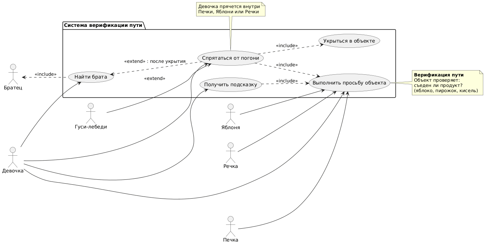

# Use Case Diagram: Система верификации пути (Гуси-лебеди)

## Актеры

| Актер | Описание |
|-------|-------------|
| Девочка | Ищет брата, выполняет просьбы объектов |
| Гуси-лебеди | Преследуют девочку и братца |
| Братец | Похищенный брат, ждёт спасения |
| Печка | Объект-помощник (пирожок) |
| Яблоня | Объект-помощник (яблоко) |
| Речка | Объект-помощник (кисель) |

## Варианты использования

### Пакет: Система верификации пути

| Вариант использования | Описание |
|----------|-------------|
| Найти брата | Найти и спасти похищенного братца |
| Спрятаться от погони | Спрятаться от гусей-лебедей |
| Выполнить просьбу объекта | Съесть продукт (яблоко, пирожок, кисель) |
| Получить подсказку | Узнать направление к брату |
| Укрыться в объекте | Объект прячет девочку от гусей |

## Связи

### Актер к варианту использования

- **Девочка** выполняет: Найти брата, Спрятаться от погони, Выполнить просьбу объекта, Получить подсказку
- **Гуси-лебеди** выполняют: Преследовать (влияют на сценарий)
- **Братец** ожидает спасения
- **Печка**, **Яблоня**, **Речка** являются объектами-помощниками

### Отношения Extend/Include

- **Спрятаться от погони** → **Выполнить просьбу объекта** (<<include>>)
- **Спрятаться от погони** → **Укрыться в объекте** (<<include>>)
- **Получить подсказку** → **Выполнить просьбу объекта** (<<include>>)
- **Найти брата** ← **Спрятаться от погони** (<<extend>>): после укрытия

## Диаграмма



```
@startuml
left to right direction

actor "Девочка" as Girl
actor "Гуси-лебеди" as Geese
actor "Братец" as Brother
actor "Печка" as Stove
actor "Яблоня" as AppleTree
actor "Речка" as River

package "Система верификации пути" {
  usecase "Найти брата" as FindBrother
  usecase "Спрятаться от погони" as Hide
  usecase "Выполнить просьбу объекта" as CompleteTask
  usecase "Получить подсказку" as GetHint
  usecase "Укрыться в объекте" as TakeShelter
}

' Девочка выполняет действия
Girl --> FindBrother
Girl --> Hide
Girl --> CompleteTask
Girl --> GetHint

' Гуси-лебеди преследуют (влияют)
Geese --> Hide : <<extend>>

' Братец ожидает спасения
Brother <.. FindBrother : <<include>>

' Объекты-помощники (связаны с просьбами)
Stove --> CompleteTask
AppleTree --> CompleteTask
River --> CompleteTask

' Зависимости внутри системы
Hide ..> CompleteTask : <<include>>
Hide ..> TakeShelter : <<include>>
GetHint ..> CompleteTask : <<include>>
FindBrother <.. Hide : <<extend>> : после укрытия

note right of CompleteTask
  **Верификация пути**
  Объект проверяет:
  съеден ли продукт?
  (яблоко, пирожок, кисель)
end note

note bottom of Hide
  Девочка прячется внутри
  Печки, Яблони или Речки
end note
@enduml
```

## Описание

Эта диаграмма вариантов использования иллюстрирует сценарий сказки, связанный с историей "Гуси-лебеди":

1. **Девочка** начинает **искать брата**
2. Она встречает **Речку**, **Яблоню**, **Печку** и должна **выполнить их просьбу** (съесть продукт)
3. После выполнения просьбы она **получает подсказку**, где искать брата
4. **Гуси-лебеди** начинают **погоню**, и девочка должна **спрятаться**
5. Чтобы спрятаться, она снова **выполняет просьбу объекта** и **укрывается** внутри него
6. После того как гуси улетают, девочка **находит и спасает братца**

Связи показывают, что получение подсказки и укрытие включают выполнение просьбы объекта, а поиск брата расширяется укрытием от погони.
